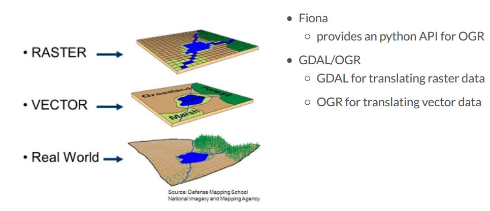

# Visualizaing Geospatial Data
- One of the most important tasks of a data scientist is to understand the relationships between their data's physical location and their geographical context
- Plot geospatial points as scatterlots
- Plot geometrics using `geopandas`
- Construct a `GeoDataFrame` from a pandas `DataFrame`
- Spatially join datasets
- Add a street map to our plots
- When and how to create a choropleth

#### Latitude and Longitude
- Longitude are the lines that run north to south, and latitude are the lines that run east to west. We use negative values for latitude south of the Equator and for longitude west of the Greenwich Meridian.
- Style elements like color and marker type helps make our plots visually appealing.
- Longitude is always plotted along the horizontal axis, while latitude is plotted along the vertical axis.

```python
plt.scatter(schools.Longitude,
            schools.Latitude,
            c = 'darkgreen',
            marker = 'p')
plt.show()

plt.scatter(schools.Longitude, schools.Latitude, c='dargreen', marker='p')
plt.xlabel('Longitude')
plt.ylabel('Latitude')
plt.title('Nashville Public Schools')
plt.grid()
plt.show()
```

#### Extracting longitude and latitude
- Datasets won't always have latitude and longitude neatly separated. In this case, we can just pull each value from the location tuple and store it in a new column.

```python
bus_stops['lat'] = [loc[0] for loc in bus_stops.Location]
bus_stops['lng'] = [loc[1] for loc in bus_stops.Location]
bus_stops.head()
```

#### Extracting lng and lat with regex
`Location : MCC - BAY 11\nNashville, TN\n(36.16659, -86.78199)`
- Some times we need to use regex to parse long and lat.

```python
lat_lng_pattern = re.compile(r'\((.*),\s*(.*)\)', flags=re.MULTILINE)

def extract_lat_lng(address):
    try:
        lat_lng_match = lat_lng_pattern.search(address)
        lat = float(lat_lng_match.group(1))
        lng = float(lat_lng_match.group(2))
        return (lat, lng)
    except:
        return (np.NaN, np.NaN)
        
lat_lngs = [extract_lat_lng(location) for location in bus_stops2.loc[:, 'Location']]
bus_stops2['lat'] = [lat for lat, lng in lat_lngs]
bus_stops2['lng'] = [lng for lat, lng in lat_lngs]
```

### Geometries and shapefiles

#### Shapefiles
- We can visualize points data on a map more effectively if we plot meaningful regions to give context to the points. One way to do this is with a shapefile.
- Shapefiles stores a special type of a data known as geometry, that is used to draw a map.
- There are 3 basic kinds of geometry: point (a single longitude/latitude pair), line (two or more lat/long pairs that can be connected to form a continuos segment)  and polygon(made up of 3 or more long/lat pairs that are joined in a specified order to create an enclosed region).

#### Shapefile components
- A shape file can be recognized by its `.shp` extension. The `.shp` file must be in a directory along with `.shx` file and `.dbf` file in order to work.
- These files needs to have a same filename prefix.

```python
my_map.shp (contains the geometry)
my_map.dbf (holds attributes for each geometry)
my_map.shx (links the attributes to the geometry)
```

### Geopandas
- The geopandas package provides a library for working with geospatial data.
- The shape file consists of two polygons - one for the general services district and another for the urban services district.

```python
import geopandas as gpd

geo_df = gpd.read_file('My_Map_Files/my_map.shp')
geo_df.head()
```

#### Viewing a geometry

```python
service_district.loc[0, 'geometry']
```

- Geometry object from the first row in the service districts GeoDataFrame.
- The `loc[]` accessor locates a specific data point when we pass the row name and column name to it, and `iloc[]` accessor locates a specific data point by using the given row index and column index.
- We can print the geometry by wrapping the call to loc or iloc with the print function. Printing the geometry gives us all the long/lat pairs that define the polygon, with each pair separated by comma.

#### Plotting a GeoDataFrame
- Plotting a GeoDataFrame is as easy as calling df.plot()
- We can make it more informative by coloring each region according to some column in the geodataframe.

```python
school_districts.plot()
plt.show()

school_districts.plot(column = 'district', legend=True)
plt.show()
```

### Scatterplots over polygons
- Combine scatterplot of chicken locations with polygons showing service districts in order to understand where the chickens are w.r.t service district boundaries.

#### Combining scatterplots and polygons
- Maps are created from visual layers, with each layer adding reference points and other cues that enhance the ability to get meaning from the map.

#### Scatterplots over ploygons

```python
school_districts.plot(column='district', legend=True, cmap='Set2')
plt.scatter(schools.lng, schools.lat, marker = 'p', c = 'darkgreen')
plt.title('NashVille schools and School districts')
plt.show()
```

### GeoJSON and plotting with geopandas
- GeoJSON is a newer format for geospatial data. Unlike shapefiles, GeoJSON is a single file, making it easier to work with.

#### Neighbourhoods GeoJSON
- The raw GeoJSON file is easier to interpret than a shape file.
- The geometry is a MultiPolygon. GeoJSON supports multipart geometries, including MultiPoint, MultiLineString and MultiPolygon.

```python
neighborhoods = gpd.read_file('./data/neighborhood_boundaries.geojson')
neighborhoods.head(1)
```

- Reading in the geojson file with geopandas, we can see that the properties of he geojson file(name and geometry) become the columns of the GeoDataFrame.

#### Geopandas dependencies



- Vector data is type of geospatial data made up of points, lines and polygons. Raster data on the other hand can be thought of as a grid. Topographical maps are example of raster graphics.
- Geopandas makes it easy to work with geospatial data in python. Two supporting libraries that help with this are FIONA and GDAL.
- FIONA provides a bridge from the Open GIS Simple Features Reference(called OGR for short) to python and geopandas. We can leverage the work that OGR and GDAL - the Geospatial Data Abstraction Library - do to translate raster and vector geospatial data formats.

#### Colormaps
- Choosing the right color when plotting our map requires a bit of thought. Matplotlib provides around 100 different colormaps.

#### Plotting with color
- We can also style plot legends by passing a dict of keywords to geopandas.

```python
council_dists.plot(column='district',
                    cmap='Set3',
                    legend=True)
plt.title('Council Districts')
plt.show()

leg_kwds={'title':'District Number',
          'loc':'upper_left',
          'bbox_to_anchor': (1, 1.03),
          'ncol':3}
council_dists.plot(column='district',
                    cmap = 'Set3',
                    legend=True,
                    legend_kwds=leg_kwds)
plt.title('Council Districts')
plt.show()
```


